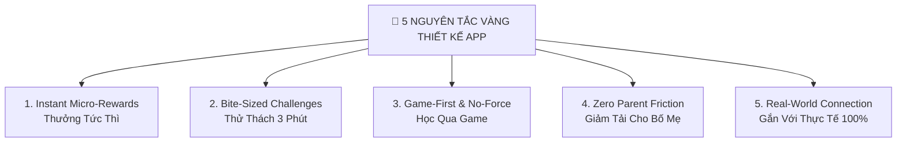

# 🌟 5 NGUYÊN TẮC VÀNG THIẾT KẾ & TÂM LÝ HỌC TRẺ EM (DESIGN & BEHAVIORAL PRINCIPLES)

File tài liệu này quy định **5 Nguyên Tắc Cốt Lõi Bất Di Bất Dịch** chỉ đạo toàn bộ việc thiết kế giao diện, tính năng, nội dung và thuật toán của ứng dụng **Hành Trình Trưởng Thành**.

---

## 📌 Triết Lý Cốt Lõi (Core Philosophy)
> *"Trẻ em không ghét việc học hay làm việc nhà. Trẻ em chỉ ghét sự khô khan, áp lực bị ép buộc và những hứa hẹn xa mờ về tương lai 10 năm nữa."*
> 
> **Hành Trình Trưởng Thành** dùng chính ngôn ngữ hào hứng của công nghệ (Sao, Pháo hoa, Thú cưng, Streak) để tạo luồng Dopamine tích cực, giúp trẻ **TỰ NGUYỆN & HÀO HỨNG** thực hiện bài học SGK, rèn nếp sống tự lập mỗi ngày.

---

---

## 💎 1. Nguyên Tắc "Instant Micro-Rewards" (Thưởng Tức Thì Ngay Trong Ngày)
- **Bản chất tâm lý**: Trẻ em 7–12 tuổi sống ở **Hiện Tại**, vỏ não trước trán chưa phát triển để hiểu "hành trang tương lai 10 năm nữa".
- **Chỉ đạo thiết kế**:
  - Mọi bài học SGK, bài toán hay việc nhà **PHẢI được đền đáp NGAY LẬP TỨC** bằng luồng Dopamine tích cực: Pháo hoa nổ ngập màn hình + Âm thanh Ting Ting + Cộng Sao tức thì.
  - Sao tích lũy đổi được ngay **Đặc quyền thực tế trong ngày** (*Phiếu chọn món ăn tối, Phiếu xem hoạt hình 30 phút, Phiếu cõng đi dạo*).

---

## 💎 2. Nguyên Tắc "Bite-Sized Challenges" (Thử Thách 3 Phút Nhẹ Nhàng)
- **Bản chất tâm lý**: Não bộ trẻ em rất nhanh nản khi đối mặt với một khối lượng bài tập dài và nặng.
- **Chỉ đạo thiết kế**:
  - KHÔNG bắt trẻ ngồi học 1 tiếng khô khan.
  - Toàn bộ bài học SGK, sách kỹ năng và toán tư duy **PHẢI được chia nhỏ thành các chặng 3–5 phút**:
    - *1 phút*: Đọc câu chuyện ngộ nghĩnh / Xem kiến thức cốt lõi.
    - *2 phút*: Làm 3 câu trắc nghiệm sinh động có giải thích ngắn gọn.
  - Bé hoàn thành bài học với tâm lý **nhẹ nhàng, không mệt mỏi, luôn cảm thấy mình chiến thắng**.

---

## 💎 3. Nguyên Tắc "Game-First & No-Force" (Học Qua Game — Không Ép Buộc)
- **Bản chất tâm lý**: Trẻ em chống đối lại sự ra lệnh và ép buộc, nhưng cực kỳ hào hứng với các nhiệm vụ nhập vai.
- **Chỉ đạo thiết kế**:
  - Thay vì giao bài tập bắt buộc $\rightarrow$ Bé học bài để **nuôi chú Cáo ảo 🦊 lớn lên, giữ ngọn lửa Streak 🔥, mở khóa Đảo Khủng Long 🦕**.
  - Dùng cơ chế Gamification để chuyển từ **"Bố mẹ ép con làm"** sang **"Con tự giác đòi làm"**.

---

## 💎 4. Nguyên Tắc "Zero Parent Friction" (Giảm Tải Tối Đa Cho Bố Mẹ)
- **Bản chất tâm lý**: Bố mẹ đi làm về tối rất mệt mỏi, nếu app bắt bố mẹ phải mở máy duyệt từng cái bát cái đĩa $\rightarrow$ App sẽ bị gỡ bỏ sau 3 ngày.
- **Chỉ đạo thiết kế**:
  - App phải giúp Bố Mẹ **nhàn hơn chứ không bận hơn**.
  - Hỗ trợ chế độ *Tự Động Duyệt Tin Tưởng (Auto-Approve)*, *Bảng Tủ Lạnh QR quét 1s*, *Báo cáo Zalo tự động tối CN* để Bố Mẹ không bị áp lực mở app duyệt hàng ngày.

---

## 💎 5. Nguyên Tắc "Real-World Connection" (Gắn Kết Thực Tế Đời Sống 100%)
- **Bản chất tâm lý**: Dữ liệu chỉ ở trên màn hình điện thoại sẽ bị trẻ coi là "game ảo" và không có tác dụng thay đổi hành vi ngoài đời.
- **Chỉ đạo thiết kế**:
  - Mọi Sao và điểm số trên app **PHẢI quy đổi ra hành động thực tế ngoài đời**: *In Bảng Tủ Lạnh dán góc học tập, Hũ tiết kiệm heo đất tiền thật, Thử thách cả nhà nấu ăn cuối tuần, Ngân hàng Sao từ thiện góp cây xanh*.
  - App là chiếc cầu nối gắn kết tình cảm giữa Bố Mẹ và Bé ngoài đời thực.
