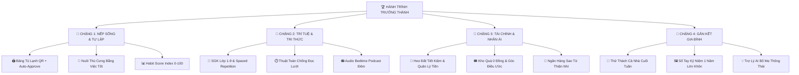

# 🏆 HỆ SINH THÁI "HÀNH TRÌNH TRƯỞNG THÀNH" (Unified Master Growth Architecture)

Đúng như tên gọi **"Hành Trình Trưởng Thành"**, ứng dụng không phải là một tập hợp tính năng rời rạc, mà là một **Hệ Thống Phiêu Lưu Nhập Vai Trưởng Thành (RPG Growth Adventure)** được kết nối chặt chẽ qua 4 Chặng phát triển nhân cách, trí tuệ và tình cảm của trẻ từ Lớp 1 đến Lớp 9.

---

## 🗺️ SƠ ĐỒ LIÊN KẾT TỔNG THỂ (4 CHẶNG TRƯỞNG THÀNH)

---

## 📍 CHẶNG 1: RÈN NẾP SỐNG & TÍNH TỰ LẬP (Nền Tảng Khởi Đầu)
- **Mục tiêu**: Biến việc nhà (dọn phòng, gấp chăn, rửa bát) từ "nghĩa vụ bị ép buộc" thành "thói quen tự giác vui vẻ".
- **Mối liên kết logic**:
  1. **Bảng Tự Giác Tủ Lạnh QR**: Bé tích ô dán nhãn thực tế trên tủ lạnh $\rightarrow$ Cuối tuần Bố Mẹ quét QR 1s đồng bộ Sao vào App. Bật chế độ *Auto-Approve* giúp Bố Mẹ không bị áp lực mở máy duyệt mỗi ngày.
  2. **Thú Cưng Tự Giác (Virtual Pet 🦊)**: Bé chọn chú Cáo nhỏ. Thú cưng "ăn" bằng Sao việc tốt. Bé tự giác làm việc nhà để nuôi chú Cáo lớn lên và tiến hóa.
  3. **Chỉ Số Nếp Sống (Habit Score 0-100)**: Tổng hợp độ đúng giờ, tính tự giác và kiên trì hiển thị trực quan cho Bố Mẹ theo dõi.

---

## 📍 CHẶNG 2: RÈN TRÍ TUỆ & TRI THỨC (Nâng Cao Năng Lực)
- **Mục tiêu**: Biến việc học bài SGK, làm toán tư duy và đọc sách thành một chuyến phiêu lưu mở khóa thế giới.
- **Mối liên kết logic**:
  1. **SGK Lớp 1-9 & Toán Tư Duy (Cấu trúc 3 bước)**: Khởi động $\rightarrow$ Luyện tập $\rightarrow$ Vận dụng thực tế.
  2. **Thuật Toán Chống Đọc Lướt & Spaced Repetition**: Đảm bảo bé đọc ngẫm nghĩ kỹ bài mới cho trắc nghiệm. Các câu sai tự động được đưa vào kế hoạch ôn tập thứ 7 / CN.
  3. **Audio Bedtime Podcast**: Sau 21h30 chuyển giao diện đêm dịu mắt, phát giọng đọc câu chuyện Hạt giống tâm hồn cho bé nghe trước khi ngủ.

---

## 📍 CHẶNG 3: TRÍ TUỆ TÀI CHÍNH & TÂM HỒN NHÂN ÁI (Bản Lĩnh & Đạo Đức)
- **Mục tiêu**: Dạy bé bài học về giá trị lao động, quản lý tiền bạc và lòng yêu thương cộng đồng.
- **Mối liên kết logic**:
  1. **Kho Quà 0 Đồng & Góc Điều Ước**: Bé đổi Sao lấy các đặc quyền thực tế (xem hoạt hình, chọn món ăn tối, đi dạo cùng Bố Mẹ) hoặc kiên trì tích lũy 500 ⭐ cho một mục tiêu lớn (Delayed Gratification).
  2. **Heo Đất Tiết Kiệm**: Bố Mẹ quy đổi Sao thành tiền thưởng nhỏ $\rightarrow$ Bé tập chia làm 3 hũ: Tiết kiệm mua đồ lớn, Chi tiêu học tập và Từ thiện.
  3. **Ngân Hàng Sao Từ Thiện**: Bé đóng góp 50 ⭐ $\rightarrow$ Góp 1 cây xanh / 1 quyển sách cho trẻ em vùng cao.

---

## 📍 CHẶNG 4: GẮN KẾT & KỶ NIỆM GIA ĐÌNH (Tình Yêu Thương Bền Chặt)
- **Mục tiêu**: Kết nối Bố Mẹ và Bé trực tiếp ngoài đời thực, lưu giữ trọn vẹn tuổi thơ của con.
- **Mối liên kết logic**:
  1. **Thử Thách Gia Đình Cuối Tuần**: Sáng Thứ 7 phát động thử thách cả nhà cùng vào bếp / đạp xe công viên $\rightarrow$ Nhận Sao đồng đội và gắn kết tình cảm.
  2. **Sổ Tay Kỷ Niệm Lớn Khôn**: Lưu lại hình ảnh minh chứng 1 năm $\rightarrow$ Sinh nhật bé tự xuất clip *"1 Năm Hành Trình Trưởng Thành của Con"*.
  3. **Sổ Tay Bố Mẹ Thông Thái (AI Parent Advisor)**: Trợ lý AI tư vấn tâm lý nuôi dạy con khoa học cho Bố Mẹ.

---

## 🚀 TÓM TẮT MÔ HÌNH THƯƠNG MẠI HÓA (PLG SAAS)

1. **🎁 14 NgàyVIP Free Trial**: Đăng ký mới dùng 100% full tính năng không cần thẻ.
2. **🌱 Free Plan Vĩnh Viễn**: Hết 14 ngày không khóa app, giữ 100% sao và lịch sử.
3. **👑 Gói Pro (49k/tháng hoặc 399k/năm)**: Mở full kho SGK Lớp 1-9, AI Gia sư, Zalo Báo cáo tuần & Thanh toán VietQR PayOS quét mã 2s.
4. **🤝 Mã Giới Thiệu (Referral)**: Mời phụ huynh trong lớp cùng dùng $\rightarrow$ Tặng thêm 10 ngày VIP cho cả 2 gia đình.
