# 📖 Kế Hoạch Tổng Thể Dự Án "Hành Trình Trưởng Thành" (Master Plan)

## 📌 1. Tầm Nhìn & Sứ Mệnh Project

**"Hành Trình Trưởng Thành"** là nền tảng công nghệ giáo dục (EdTech SaaS) giúp trẻ em tự giác hình thành nếp sống tốt, chăm chỉ đọc sách, học bài và giúp đỡ việc nhà thông qua cơ chế Gamification (Tích sao đổi quà), thuật toán thông minh và sự đồng hành tích cực của Bố Mẹ.

---

## 🏛️ 2. Kiến Trúc 5 Trụ Cột Thương Mại Hóa

```mermaid
graph TD
    A[Hành Trình Trưởng Thành v2.5+] --> B[Trụ cột 1: PLG & Commercialization]
    A --> C[Trụ cột 2: Advanced Logic & Algorithms]
    A --> D[Trụ cột 3: Standardized Content]
    A --> E[Trụ cột 4: AI & Value-Added Features]
    A --> F[Trụ cột 5: School Portal & Security]

    B --> B1[14-Day Free VIP Trial]
    B --> B2[Free Forever No-Lock Plan]
    B --> B3[VietQR / PayOS Auto Payment]
    
    C --> C1[Spaced Repetition Review]
    C --> C2[Habit Score Index 0-100]
    C --> C3[Anti-Cheating Reading Pace]
    C --> C4[Dynamic Star Multipliers]

    D --> D1[Full Primary & Secondary Textbooks Lớp 1-9]
    D --> D2[English Kids Corner with Audio]
    D --> D3[Financial Literacy Savings]

    E --> E1[AI Tutor Wisdom Owl]
    E --> E2[Zalo / Email Weekly Digest]

    F --> F1[Teacher & School Portal]
    F --> F2[COPPA & Privacy Compliance]
```

---

## 🗓️ 3. Lộ Trình Phát Triển Chi Tiết (Product Roadmap)

### Giai đoạn 1: Chuẩn Hóa Logic & Trải Nghiệm Học Tập (Hiện tại - Tháng 8/2026)
- [x] **Xác thực & Hồ sơ Netflix**: Bảo mật PIN 4 chữ số cho Bố Mẹ và từng bé.
- [x] **Gamification v1**: Tích sao, đổi quà, duyệt yêu cầu, khu game đổi vé 5 phút.
- [x] **Level & Streak**: Hệ thống 6 cấp độ (🌱 Mầm Non $\rightarrow$ 🏆 Thần Đồng), chuỗi lửa 🔥 daily streak, bảng 6 huy hiệu thành tựu.
- [x] **Thống kê Bố Mẹ**: Biểu đồ cột CSS 7 ngày gần nhất & thẻ KPI.
- [x] **Lưu trữ vĩnh viễn**: Dual-sync LocalStorage + Supabase database chống mất dữ liệu.
- [ ] **Thuật toán Chống Đọc Lướt & Thưởng Sao Động**: Kiểm tra thời gian dừng trang + Bonus tự giác trước 20h.

### Giai đoạn 2: Thương Mại Hóa PLG & Cổng Thanh Toán (Tháng 9/2026)
- [ ] **Bảng Subscriptions & 14 Ngày VIP Trial**: Đăng ký mới tự động mở 100% tính năng 14 ngày không cần thẻ.
- [ ] **Free Plan Vĩnh Viễn**: Hết 14 ngày giữ nguyên số sao, không khóa app, cho phép dùng tính năng cơ bản.
- [ ] **Tích hợp VietQR / PayOS**: Quét mã tự động kích hoạt gói Pro (49k/tháng hoặc 399k/năm) sau 2 giây.
- [ ] **Mã Giới Thiệu (Referral System)**: Mời bạn bè nhận thêm 10 ngày VIP cho cả 2 gia đình.

### Giai đoạn 3: Thuật Toán Nâng Cao & Trợ Lý AI (Tháng 10/2026)
- [ ] **Thuật toán Spaced Repetition**: Tự động đưa các câu hỏi làm sai vào kế hoạch ôn tập thứ 7 / CN.
- [ ] **Chỉ số Nếp sống (Habit Score 0-100)**: Đánh giá độ tự giác, đúng giờ và kiên trì của bé.
- [ ] **AI Gia sư "Cú Thông Thái 🦉"**: Tích hợp Google Gemini API giải đáp thắc mắc bài học an toàn cho trẻ.
- [ ] **Báo cáo Zalo ZNS / Email hàng tuần**: Tự động gửi tổng kết thành tích của bé tới Bố Mẹ tối CN.

### Giai đoạn 4: Mở Rộng Kho Nội Dung & Portal Trường Học (Tháng 11/2026+)
- [ ] **Bổ sung SGK Lớp 1, 3, 4, 5, 6, 7, 9**: Đầy đủ bộ sách *Kết nối tri thức*, *Cánh Diều*, *Chân trời sáng tạo*.
- [ ] **Góc Tiếng Anh & Heo Đất Tiết Kiệm**: Bài đọc tiếng Anh có âm thanh & quy đổi Sao sang tiền tiết kiệm thực tế.
- [ ] **School Portal**: Dành cho Giáo viên giao bài tập tuần cho cả lớp & theo dõi báo cáo.

---

## 📌 4. Hướng Dẫn Thực Hiện Khi Quay Lại
1. Mở file [ALGORITHMS_DESIGNS.md](./ALGORITHMS_DESIGNS.md) để xem công thức và logic toán học của các thuật toán cần cài đặt.
2. Mở file [COMMERCIALIZATION_MODEL.md](./COMMERCIALIZATION_MODEL.md) để xem kịch bản dùng thử 14 ngày & tích hợp cổng VietQR PayOS.
3. Mở file [TECHNICAL_SCHEMA_API.md](./TECHNICAL_SCHEMA_API.md) để lấy mã SQL tạo bảng database và các hàm API helper.
