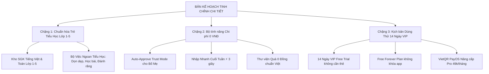

# 🎯 CHIẾN LƯỢC TRỌNG TÂM TIỂU HỌC & HỆ THỐNG CHI PHÍ 0 VNĐ (PRIMARY & ZERO-COST STRATEGY)

Tài liệu này chi tiết hóa 2 quyết định chiến lược quan trọng của dự án:
1. **Tập trung 100% nguồn lực vào nhóm Trẻ Tiểu Học (Lớp 1 – 5, từ 6 đến 10 tuổi)** — Độ tuổi vàng uốn nắn thói quen.
2. **Xây dựng hạ tầng vận hành với CHI PHÍ 0 VNĐ (Zero-Cost Infrastructure)** — Tuyệt đối không tốn phí duy trì hàng tháng.

---

## 🎒 1. TẠI SAO TẬP TRUNG NHÓM TRẺ TIỂU HỌC (LỚP 1 - 5)?

```
   👶 Lớp 1 - 2 (6-7 tuổi)  ➔ Rèn Nếp sống Tự lập (Xếp chăn màn, dọn đồ chơi, ăn đúng giờ)
   👦 Lớp 3 - 4 (8-9 tuổi)  ➔ Rèn Tính Chăm chỉ (Tự giác đọc sách SGK, làm toán tư duy)
   👦 Lớp 5 (10 tuổi)       ➔ Rèn Tính Tự lập & Tài chính nhí (Gấp quần áo, nuôi heo đất)
```

### Lý do lựa chọn:
- **Độ tuổi vàng để uốn nắn**: Trẻ tiểu học chưa bước vào tuổi dậy thì bướng bỉnh, bé còn rất nghe lời Bố Mẹ và hào hứng với các phần thưởng nhỏ.
- **Tâm lý thích tích sao & nuôi thú cưng**: Trẻ 6-10 tuổi cực kỳ thích các nhân vật hoạt hình (Chú Cáo 🦊, Panda 🐼) và hiệu ứng nổ pháo hoa.
- **Áp lực học SGK bắt đầu từ Lớp 1**: Bố Mẹ tiểu học rất lo lắng chuyện con tự giác chuẩn bị bài SGK Tiếng Việt & Toán trước khi đến lớp.

---

## 💰 2. HỆ THỐNG HẠ TẦNG CHI PHÍ 0 VNĐ (ZERO-COST ARCHITECTURE)

Để đảm bảo dự án vận hành **hoàn toàn 0 VNĐ chi phí cố định hàng tháng**, toàn bộ giải pháp kỹ thuật được lựa chọn trên các nền tảng miễn phí chuyên nghiệp:

| Thành phần hạ tầng | Giải pháp kỹ thuật | Chi phí hàng tháng | Ghi chú |
|:---|:---|:---:|:---|
| **Cơ sở dữ liệu (Database)** | Supabase PostgreSQL (Free Tier) | **0 VNĐ** | Miễn phí 500MB DB & 50.000 người dùng hàng tháng |
| **Lưu trữ ứng dụng (Hosting)** | Vercel / Netlify (Free Tier) | **0 VNĐ** | Miễn phí Unlimited Bandwidth & SSL bảo mật |
| **Cổng thanh toán (Payment)** | PayOS / VietQR MBBank API | **0 VNĐ** | Quét mã QR trực tiếp về TK ngân hàng, **không tốn % phí giao dịch** |
| **Thông báo nhắc nhở (Noti)** | Web Push Notification & Email Resend | **0 VNĐ** | Thay thế Zalo ZNS tốn phí bằng Web Push + Email 3.000 thư/tháng 0đ |
| **Icon & Âm thanh (Assets)** | Canvas Confetti + Web Speech API | **0 VNĐ** | Âm thanh giọng đọc & hiệu ứng nổ pháo hoa có sẵn trong trình duyệt |

---

## 📋 3. LỘ TRÌNH TINH CHỈNH KẾ HOẠCH TOÀN DIỆN (CHỜ DUYỆT TRƯỚC KHI LÀM)



---

Bản kế hoạch này đảm bảo dự án vừa **đúng trọng tâm nhóm tiểu học**, vừa **hoàn toàn không tốn chi phí duy trì**, tạo sự yên tâm tuyệt đối cho bạn trước khi tiến hành lập trình!
