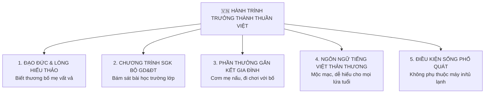

# 🇻🇳 KHUNG THIẾT KẾ CHUẨN VĂN HÓA GIA ĐÌNH VIỆT NAM (VIETNAMESE FAMILY PARENTING FRAMEWORK)

Tài liệu này quy định **Định hướng Văn hóa & Lối sống thuần Việt** cho ứng dụng **Hành Trình Trưởng Thành**. Tuyệt đối không sao chép hay lai căng các ứng dụng phương Tây (như ClassDojo, Habitica) vốn có sự khác biệt lớn về tâm lý, văn hóa và môi trường giáo dục.

---

## 🏛️ 1. Khác Biệt Cốt Lõi Giữa Văn Hóa Việt Nam & Phương Tây

| Tiêu chí | Văn hóa Phương Tây (Tây hóa) | Văn hóa Gia Đình Việt Nam (Thuần Việt) | Định hướng Thiết kế của App |
|:---|:---|:---|:---|
| **Động lực làm việc nhà** | Làm việc nhà để kiếm tiền tiêu vặt (Chore Allowance). | Việc nhà là sự **đỡ đần, hiếu thảo & thương yêu bố mẹ**. | Thưởng Sao tinh thần + Khen ngợi bé ngoan hiếu thảo, không biến việc nhà thành giao dịch tiền bạc. |
| **Phần thưởng** | Đồ chơi đắt tiền, tiền mặt, thẻ game. | Món ăn con thích, chuyến về quê thăm ông bà, đặc quyền gia đình. | Kho quà chuẩn Việt: *"Phiếu mẹ nấu món con thích"*, *"Phiếu đi công viên với bố"*, *"Phiếu về quê thăm ông bà"*. |
| **Chương trình học** | Tự do khám phá, không áp lực điểm số SGK. | Bám sát **Chương trình SGK Bộ GD&ĐT**, bài tập về nhà, thi học kỳ. | Tích hợp 100% SGK Tiếng Việt, Toán, Ngữ Văn các lớp, giúp bé tự giác chuẩn bị bài trước khi đến lớp. |
| **Giao tiếp & Ngôn ngữ** | Dùng từ tiếng Anh: Streak, Level, Quests, Gamification. | Ngôn ngữ mộc mạc, thuần Việt, gần gũi với Bố Mẹ & Bé. | 100% Tiếng Việt thân thương: *Chuỗi Ngày Chăm Chỉ, Cấp Độ Ngoan, Việc Ngoan Hàng Ngày*. |
| **Kênh thông báo** | Email, Push Notification. | **Zalo** (kênh giao tiếp quốc dân của mọi gia đình Việt). | Tích hợp thông báo qua Zalo cho Bố Mẹ. |

---

## 🌾 2. 5 Trụ Cột Văn Hóa Thuần Việt Trong App

---

### 🟢 Trụ Cột 1: Giáo Dục Lòng Hiếu Thảo & Biết Thương Bố Mẹ
- **Thông điệp cốt lõi**: *"Bố mẹ đi làm vất vả nuôi con, con giúp bố mẹ lau cái bàn, quét cái nhà là con ngoan hiếu thảo."*
- **Tính năng**:
  - Khi bé hoàn thành việc nhà, app phát lời khen mộc mạc: *"Bé Tùng Anh ngoan quá, đã biết giúp mẹ lau bàn ăn sạch bóng rồi nè! ❤️"*.
  - Bố Mẹ gửi lời phê thân thương: *"Bố mẹ rất tự hào về con!", "Cố lên con yêu!"*.

### 🟢 Trụ Cột 2: Bám Sát Chương Trình SGK Bộ Giáo Dục & Đào Tạo
- **Nội dung bài học**:
  - Tích hợp chuẩn xác bài học SGK Tiếng Việt, Toán, Ngữ Văn theo từng tuần học của Bộ GD&ĐT Việt Nam (bộ sách *Kết nối tri thức*, *Cánh Diều*, *Chân trời sáng tạo*).
  - Giúp bé **tự giác đọc trước bài SGK tối hôm trước** để hôm sau lên lớp tự tin giơ tay phát biểu.

### 🟢 Trụ Cột 3: Kho Phần Thưởng Gắn Kết Gia Đình Thuần Việt
- App dựng sẵn bộ danh mục phần thưởng thuần Việt vô cùng gần gũi:
  - 🍚 *"Phiếu Mẹ nấu món ăn con thích nhất vào tối nay"*
  - 🚲 *"Phiếu Bố đưa đi chở xe đạp / đi chơi công viên cuối tuần"*
  - 👵 *"Phiếu Cuối tuần cả nhà về quê thăm Ông Bà"*
  - 🍦 *"Phiếu Bố Mẹ thưởng 1 cây kem mát lạnh"*
  - 📖 *"Phiếu Bố/Mẹ đọc truyện cổ tích ru con ngủ"*

### 🟢 Trụ Cột 4: Ngôn Ngữ Thuần Việt — Mộc Mạc & Dễ Sử Dụng
- Loại bỏ hoàn toàn các thuật ngữ tiếng Anh lai căng. Sử dụng từ ngữ mộc mạc:
  - ~~Streak~~ $\rightarrow$ **Chuỗi Ngày Chăm Chỉ 🌾**
  - ~~Level~~ $\rightarrow$ **Cấp Độ Ngoan 🌿** (Mầm Ngoan $\rightarrow$ Cây Xanh $\rightarrow$ Đại Thụ $\rightarrow$ Trưởng Thành)
  - ~~Tasks~~ $\rightarrow$ **Việc Ngoan Hàng Ngày 🧹**
  - ~~Redemption Shop~~ $\rightarrow$ **Cửa Hàng Thưởng Ngoan 🎁**
  - ~~Leaderboard~~ $\rightarrow$ **Bảng Thi Đua Chăm Chỉ 🏆**

### 🟢 Trụ Cột 5: Phù Hợp Điều Kiện Mọi Gia Đình Việt Nam
- Không yêu cầu máy in, tủ lạnh hay thiết bị đắt tiền.
- Bố Mẹ dùng điện thoại bình dân hay máy tính bảng đều mở app mượt mà.
- Hỗ trợ **Zalo** gửi báo cáo tuần trực tiếp cho Bố Mẹ.
